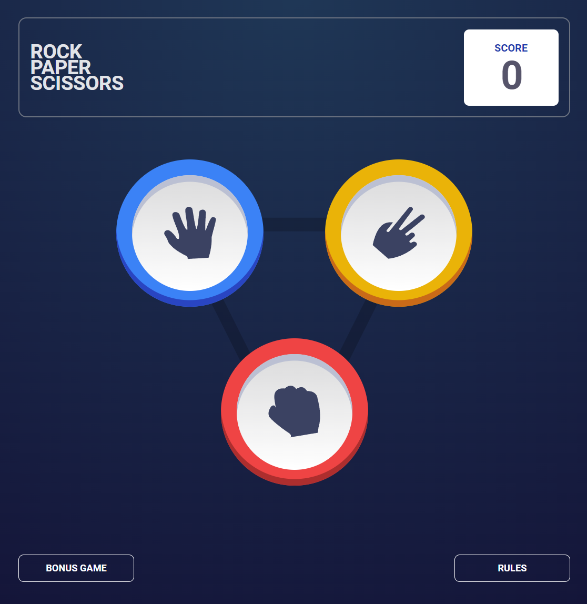

# Vue Rock Paper Scissors App



[Rock Paper Scissors App](https://dan-5150.github.io/vue-rock-paper-scissors-app/) is a Vue 3 app that allows you to play rock paper scissors (lizard spock)!

## Built With

- [Vue.js](https://vuejs.org/)
- [Pinia](https://pinia.vuejs.org/)
- [Typescript](https://www.typescriptlang.org/)
- [TailwindCSS](https://tailwindcss.com/)

## Project setup

### Install dependencies

```bash
npm install
```

### Run locally

```bash
npm run dev
```

### Lints and fixes files

```bash
npm run lint:fix
```

### Create production build

```bash
npm run build
```
